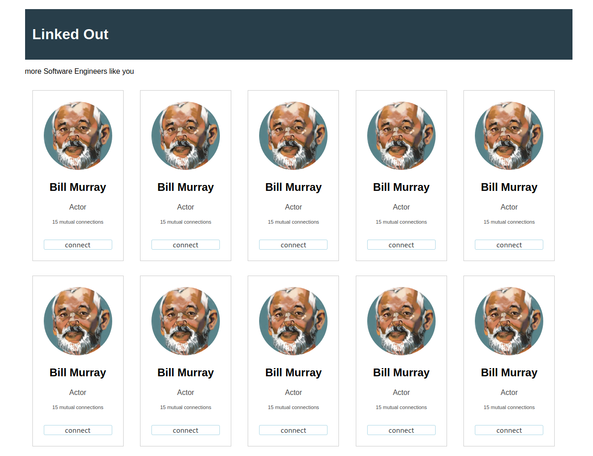

# Hands on - HTML and CSS

In this session we will work on trying to get some HTML look like we
want to.

## Linkedout

This is how we want our webpage to end up looking like.  We won't edit
the HTML at all here, we will start with the given HTML and just edit
the CSS.

## Guidelines

Some design guidelines:

|:-----------------------------------|:------------|
| footer & header `background-color` | `#283E4A`   |
| `font-family`                      | `arial`     |
| connect button `border-color`      | `lightblue` |
| member `border-color`              | `#CCC`      |
| .container `max-width`             | 1200px      |
